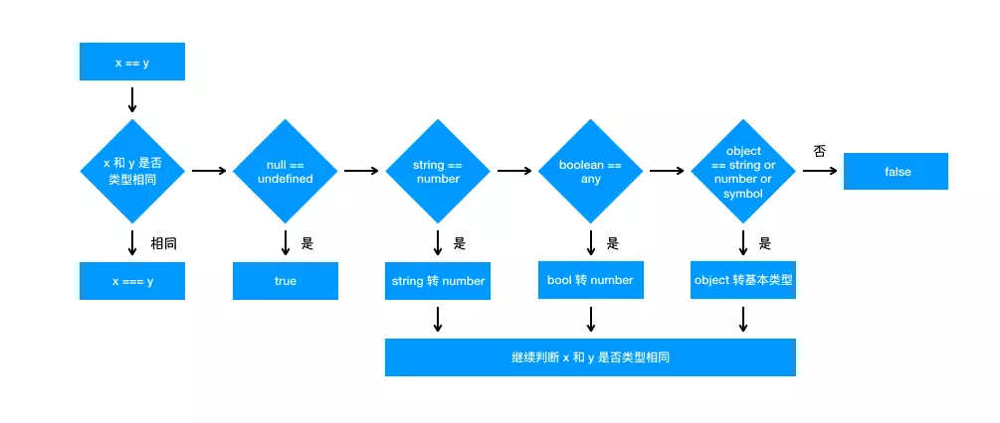

# js 基础
### 1. 闭包
一句话：**闭包**是有权访问其他函数内部变量的函数。

问题：为什么非闭包不能访问？什么是作用域？

答： 由于在js中函数执行完，作用域便会销毁，内存回收，但是由于闭包是建立在一个函数内部的子函数，可以访问上级作用域，所以不会被销毁。
[https://zhuanlan.zhihu.com/p/29157822](https://zhuanlan.zhihu.com/p/29157822)

### 2. new操作符做了什么

1. 创建一个空对象，o = new Object().
2. 这个对象的原型指针指向构造函数的原型，o.__proto__ = F.prototype.
3. 更改作用域，F.call(o)
```
function create() {
  var o = {}
  var F = [...arguments][0]
  o.__proto__ = F.prototype
  F.call(o)
  return o
}
```

### 3. es5继承（哪些方式）
> -- from 《js设计模式/js高程》

[参考](http://note.youdao.com/noteshare?id=e8b2917235e32358361469381b3799bf)
1. 类式继承
```
// 子类(A)的原型指向父类(B)的实例。
A.prototype = new B()
// 缺点： 如果父类原型有属性是引用类型，则其中一个子类更改类会影响其他子类
```
2. 构造函数继承
```
// 在子类里调用父类（构造函数）
function A(){
  B.call(this, args)
}
// 缺点： 父类原型不会被子类继承。
```
3. 组合继承
```
// 在2.构造函数继承基础上加上1.类继承
A.prototype = new B()
// 缺点： 多次调用父类构造函数。
```
4. 原型继承
```
// 借助一个函数，该函数返回一个匿名实例
function inherit(o) {
  function F(){}
  F.prototype = o
  return new F()
}
// 缺点： 和1.类继承一样
```
5. 终极模式
```
function inherit(o) {
  function F(){}
  F.prototype = o
  return new F()
}

function extend(Sub, Sup) {
  // 复制一份父类的原型副本保存在变量中，
  var p = inherit(Sup.prototype)
  // 修正因为重写子类导致子类的constructor属性被修改。
  p.constructor = Sub
  Sub.prototype = p
}

// 使用
extend(A, B)
```
### 4. 0.2+0.1不等于0.3问题
- 对于单精度浮点数，采用32位存储，最高的1位是符号位s，接着的8位是指数E，剩下的23位为有效数字M。
- 对于双精度浮点数，采用64位存储，最高的1位是符号位S，接着的11位是指数E，剩下的52位为有效数字M。

单精度**指数**范围是-126 ～ +127，双精度是 -1022 ～ +1023，

浮点转化为二进制，整数部分采用除2取余，小数部分采用乘2取整。
eg: 13.125 --> 1011.001 = 1.011001 * 2^3, M为 1.011001,E为3,s为0

e=E+127，即e=3+127=130，130的二进制表示为10000010
0  10000010  01100100000000000000000

**因为1<=M<2**,所以M第一位总是等于1，省略。

0.1 --> 0.0001100110011(0011循环) = 1.100110011(0011)*2^-4
s=0; e= -4+1023=1019, M=1.100110011(0011)
0.2 --> 0.001100110011(0011循环) = 1.100110011(0011)*2^-3

> 该数表示的即0.1+0.2的结果 2^-2 * 1.0011001100110011001100110011001100110011001100110100<br>
> 将其转换成十进制数为：0.3000000000000000444089209850062616169452667236328125<br/>
> 由于精度问题，只取到0.30000000000000004

[参考链接：http://coolcao.com/2016/10/12/js%E4%B8%AD0-1-0-2%E4%B8%BA%E4%BB%80%E4%B9%88%E4%B8%8D%E7%AD%89%E4%BA%8E0-3/](http://coolcao.com/2016/10/12/js%E4%B8%AD0-1-0-2%E4%B8%BA%E4%BB%80%E4%B9%88%E4%B8%8D%E7%AD%89%E4%BA%8E0-3/)
### 5. js执行机制
[参考链接：https://juejin.im/post/59e85eebf265da430d571f89](https://juejin.im/post/59e85eebf265da430d571f89)
1. js是一门单线程语言,js所谓的异步其实都是用同步的方法去模拟的。
2. js事件循环是js实现异步的一种方法，也是js的执行机制。
    1. js执行时，同步任务进入主线程，异步任务进入事件表。
    2. 当指定的任务完成时，事件表将这个函数移入事件队列。
    3. 主线程执行完毕为空时，会去事件队列中读取函数，进入主线程执行。
    4. 重复1、2、3。这个就事件循环。
3. 事件队列又分为宏任务事件队列和微任务事件队列。**浏览器环境**：每执行完“**一个**”宏任务，便会去判断微任务队列中有没有要执行的。**node环境(<v12)**：每执行完“**一轮**”宏任务(当前宏任务队列里的所有)，才会去判断微任务队列中有没有要执行的。
4. js执行和运行有很大的区别,在不同环境下，执行方式不同，而运行大多指js解析引擎，是统一的。

### 6. 垃圾回收
1. 标记清除
> 给当前不使用的值加上标记，然后回收其内存。
2. 引用计数
> 跟踪所有值被引用的次数，当次数变为0,然后回收其内存。存在循环引用的问题。目前js引擎都不在使用这种算法。
3. GC回收(原因：大内存的回收耗时长，造成卡顿)
> 根据对象的使用频率分为新生代(存在时间短易回收)、老生代对象，把需要长耗时回收拆分运行，减少中断时间，但是会增大上下文切换开销。

管理内存：可以对全局变量手工解除；globalPerson = null

### 8. toString 与 valueOf 区别
[https://segmentfault.com/a/1190000010824347](https://segmentfault.com/a/1190000010824347)

1. toString( ):返回对象的字符串表示。
2. valueOf( ):返回对象的字符串、数值或布尔值表示。
```
var d = {test:'123',example:123}
var e = function(){console.log('example');}
var f = ['test','example'];

d.toString(); // "[object Object]"
e.toString(); // "function (){console.log('example');}"
f.toString(); // "test,example"

d.valueOf(); // {test:'123',example:123}
e.valueOf(); // function(){console.log('example');}
f.valueOf(); // ['test','example']
```
> 一般用操作符单独对对象进行转换的时候，如果对象存在valueOf或toString改写的话，就先调用改写的方法，valueOf更高级，如果没有被改写，则直接调用对象原型的valueOf方法。是弹窗的话，直接调用toString方法。

### 9. 防抖与节流
[https://juejin.im/post/5b8de829f265da43623c4261](https://juejin.im/post/5b8de829f265da43623c4261)
> 防抖：在事件被触发n秒后再执行回调，如果在这n秒内又被触发，则重新计时。
> 节流：规定在n秒内，只能触发一次函数。如果在n秒内触发多次函数，只有一次生效。
```
// 防抖
function debounce(cb, delay) {
  return function() {
    clearTimeout(cb.timer)
    cb.timer = setTimeout(function(){
      cb()
    }, delay)
  }
}
function doAjax() {
  console.log('doAjax')
}
var debounceAjax = debounce(doAjax, 1000)
addEventListener('scroll', debounceAjax)
```
```
// 节流
function throttle(cb, delay) {
  let last
  return function() {
    let now = +new Date()
    if (now < last + delay) {
      clearTimeout(cb.timer)
      cb.timer = setTimeout(function(){
        cb()
      }, delay)
    } else {
      cb()
      last = now
    }
  }
}

function doAjax() {
  console.log('doAjax')
}

var throttleAjax = throttle(doAjax, 1000)
addEventListener('scroll', throttleAjax)
```

### 10. 深拷贝(from vuex源码)
```
function deepCopy(obj, cache=[]){
  if (obj === null || typeof obj !== 'object'){
    return obj
  }

  // 避免循环引用导致爆栈
  const hit = cache.find(i => i.original === obj)
  if(hit) {
    return hit.copy
  }

  let copy = Array.isArray(obj) ? [] : {}
  cache.push({
    original: obj,
    copy
  })
  Object.keys(obj).forEach(key => {
    copy[key] = deepCopy(obj[key], cache)
  })

  return copy
}
```

### 11. 类型转化
1. typeof 对于原始类型来说，除了 null 都可以显示正确的类型 ```typeof null // object```,但是null不是对象，是基本数据类型。
2. typeof 对于对象来说，除了函数都会显示 object, 所以说 typeof 并不能准确判断变量到底是什么类型
```
typeof [] // 'object'
typeof {} // 'object'
typeof console.log // 'function'
```
3. 转Boolean: 在条件判断时，除了 undefined， null， false， NaN， ''， 0， -0，其他所有值都转为 true，包括所有对象。
4. == 时

```
1. 首先会判断两者类型是否相同。相同的话就是比大小了
2. 类型不相同的话，那么就会进行类型转换
3. 会先判断是否在对比 null 和 undefined，是的话就会返回 true
4. 判断两者类型是否为 string 和 number，是的话就会将字符串转换为 number
5. 判断其中一方是否为 boolean，是的话就会把 boolean 转为 number 再进行判断
6. 判断其中一方是否为 object 且另一方为 string、number 或者 symbol，是的话就会把 object 转为原始类型再进行判断

Number({}) // NaN
Number([]) // 0
[] == ![] // true
'1' == true // true
'2' == true // false
```
5. +-*/ 四则运算时
- 运算中其中一方为字符串，那么就会把另一方也转换为字符串
- 如果一方不是字符串或者数字，那么会将它转换为数字或者字符串
### 12. 原型


### 13. 事件
#### 1. 事件流：冒泡、捕获。
#### 2. 事件处理程序
- 标签里的 onclick
- btn.onclick
- addEventListen('click', function)
- attachEvent('click', function)
#### 3. 事件对象 event
#### 4. 事件类型
1. UI事件：load, unloader, error, resize, scroll, select
2. 焦点事件：focus, blur
3. 鼠标与滚轮事件：click, dbclick, mousedown, mouseenter, mouseleave, mousemove, mouseout, mouseover, mouseup
```
除了 mouseenter 和 mouseleave，所有鼠标事件都会冒泡。
mouseover：当鼠标移入某元素时触发，移入和移出其子元素时也会触发。
mouseout：当鼠标移出某元素时触发，移入和移出其子元素时也会触发。
```
4. 键盘事件：keydown, keyup
5. 变动事件：DOMSubtreeModified(dom树变化), DOMNodeInserted, DOMNodeRemoved,,,
6. HTML5 事件：contextmenu(自定义右键), beforeunload(页面卸载前), DOMContentLoad(DOM树之后就出发，不理会img,js,,是否下载完毕), readystatechange(IE), hashchange(URL #变化)
7. 触摸事件：touchstart, touchmove, touchend, touchcancel
#### 5. 性能
限制页面中事件处理程序的数量，使用事件委托，适当时机移除事件处理程序。

### 13. requestAnimationFrame
setTimeout、setInterval 不准，可用 requestAnimationFrame 实现。
> 首先 requestAnimationFrame 自带函数节流功能，基本可以保证在 16.6 毫秒内只执行一次（不掉帧的情况下），并且该函数的延时效果是精确的，没有其他定时器时间不准的问题，当然你也可以通过该函数来实现 setTimeout。
```
function setInterval(callback, interval) {
  let timer
  const now = Date.now
  let startTime = now()
  let endTime = startTime
  const loop = () => {
    timer = window.requestAnimationFrame(loop)
    endTime = now()
    if (endTime - startTime >= interval) {
      startTime = endTime = now()
      callback(timer)
    }
  }
  timer = window.requestAnimationFrame(loop)
  return timer
}

let a = 0
setInterval(timer => {
  console.log(1)
  a++
  if (a === 3) cancelAnimationFrame(timer)
}, 1000)
```
### 14. 手写call、apply、bind
```
// call
/* eg: A.myCall(obj)
利用 obj = {
  name: 'Tom'
  fn: function() {
    return this.Tom
  }
} */

Function.prototype.myCall = function(ctx) {
  ctx = ctx || window
  // 将函数 A 放到 obj 上 调用obj.fn时，A里的 this 指向 obj。
  ctx.fn = this
  const args = [...arguments].slice(1)
  const res = ctx.fn(...args)
  delete ctx.fn
  return res
}

// apply
Function.prototype.myApply = function(ctx) {
  ctx = ctx || window
  ctx.fn = this
  const res = ctx.fn(arguments[1])
  delete ctx.fn
  return res
}
// bind
Function.prototype.myBind = function(ctx) {
  let that = this
  const args = [...arguments].slice(1)
  return function() {
    return that.apply(ctx, [...args, ...arguments])
  }
}
```

### 15. WebviewJavascriptBridge 原理
app和js各维护WebviewJavascriptBridge<br>

- appCallJs: app可以直接调用window下的对象/方法。
- jsCallApp: 通过 URL 拦截。params 放到message队列里,供app取。
```
WebviewJavascriptBridge = {
  callHandler: function(){
    _doSend()
  },
  registerHandler: function(){}
}

// message={handleName, params}
function _doSend(message, responseCallback){
  responseCallbacks[callbackId] = responseCallback;
  sendMessageQueue.push(message);
  iframe.src = "https://__wvjb_queue_message__"
}
```


